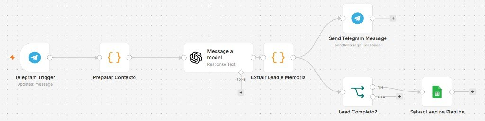
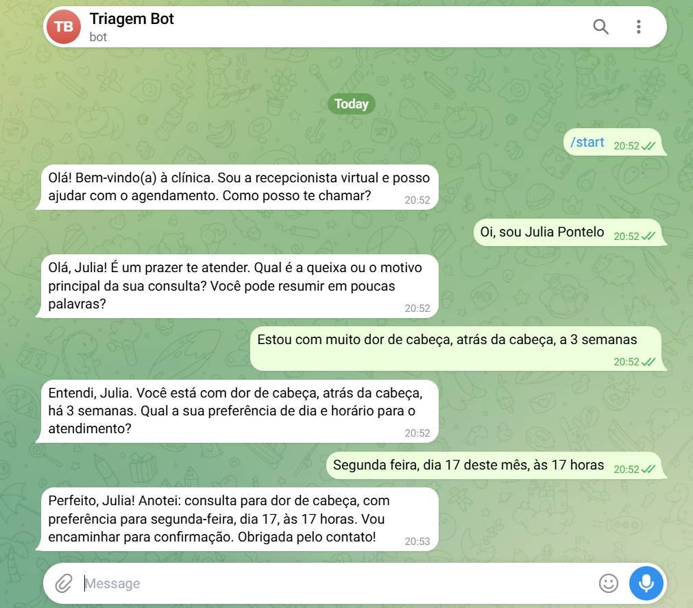
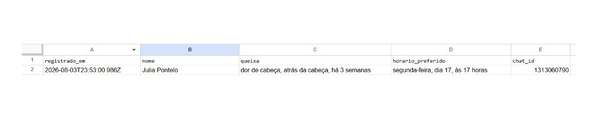

# Assistente de Triagem para Clínicas

Prova de conceito de automação de atendimento inicial. O paciente conversa por Telegram, o fluxo conduz a triagem básica com OpenAI e, ao final, registra o lead na planilha da recepção (Google Sheets).

O objetivo é demonstrar um caso prático de automação: conversa com regras de negócio claras e saída estruturada, sem pretender ser um sistema clínico completo.

## Escopo

O assistente coleta:

1. Nome do paciente  
2. Queixa principal  
3. Preferência de horário  

Em seguida, confirma o resumo com a pessoa e gera um lead estruturado. Com o nó do Google Sheets ativo, os dados são gravados automaticamente na planilha.

## Demonstração em vídeo

[Assistir à demonstração (Google Drive)](https://drive.google.com/file/d/11BnvpNhbchRRga6ZAnkTlYF0Zn1F9LJo/view?usp=sharing)

## Por que Telegram

A integração utiliza Telegram para facilitar testes e demonstração ponta a ponta, evitando a complexidade de configuração da API oficial do WhatsApp/Meta nesta PoC.

## Estrutura do repositório

- `workflow-triagem.json` — fluxo n8n  
- `system-prompt.txt` — instruções de tom, limites e conduta da recepção  
- `exemplos/leads-modelo.csv` — modelo de colunas da planilha  
- `preview-arquitetura.jpeg` — canvas do fluxo  
- `preview-chat.jpeg` — conversa de exemplo  
- `preview-planilha.jpeg` — lead registrado no Sheets  

## Capturas

Fluxo no n8n:



Exemplo de conversa:



Lead na planilha:



## Como executar

Suba o n8n:

```bash
docker run -it --rm --name n8n -p 5678:5678 -v n8n_data:/home/node/.n8n docker.n8n.io/n8nio/n8n
```

Acesse `http://localhost:5678`, configure as credenciais de OpenAI e Telegram e importe `workflow-triagem.json`.

Para o Telegram Trigger em ambiente local, é necessário expor o n8n com HTTPS (por exemplo, túnel Cloudflare/ngrok) e definir `WEBHOOK_URL` com a URL pública. Em seguida, ative o workflow e inicie a conversa com o bot.

### Google Sheets (recomendado na demo)

1. Crie uma planilha com a aba `Leads`  
2. Utilize os cabeçalhos de `exemplos/leads-modelo.csv`  
3. Configure a credencial Google (OAuth — cliente do tipo **Aplicativo da Web**)  
4. No nó **Salvar Lead na Planilha**, substitua o ID placeholder pelo ID do documento e ative o nó (ele vem desabilitado no export)  

## Geração do lead

Ao concluir a triagem, o modelo inclui um bloco técnico na resposta. O fluxo remove esse bloco antes de enviar a mensagem ao paciente e utiliza os campos para registro:

```text
<<<TRIAGEM>>>
{"nome":"...","queixa":"...","horario_preferido":"...","status":"completo"}
<<<FIM>>>
```

## Tecnologias

n8n, OpenAI (`gpt-4o-mini`), Telegram Bot API, Google Sheets e Docker.

## Limitações

- Não realiza agendamento efetivo no sistema da clínica  
- A memória da conversa depende do estado interno do n8n e pode ser reiniciada  
- Não substitui atendimento médico nem a recepção humana  
- Ferramentas de IA foram utilizadas no desenvolvimento; o foco do repositório é o fluxo e a aplicabilidade prática  

## Autor

Yuri Carvalhais — desenvolvimento de software, automações e integrações.
